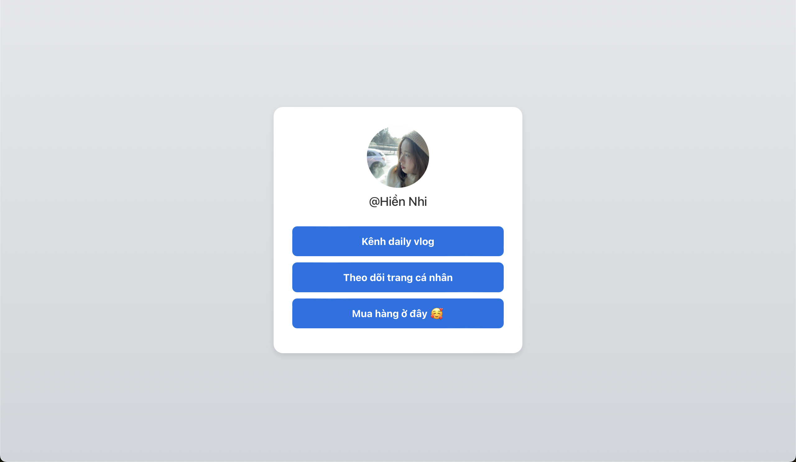

# 🌟 Link-in-bio - Link-Sharing Solution

Welcome to **Link-in-bio**empowers you to create a personalized, stylish landing page that houses all your important links in one place. Whether you're a content creator, entrepreneur, or just someone who wants to share their online presence, Link-in-bio makes it easy to connect with your audience.

---

## 🚀 Features

- **Create Your Hub**: Sign up and create your own LinkHub page in minutes.
- **Add Links**: Share as many links as you want—no limits!
- **Custom URLs**: Get a unique URL like `linkhub.to/yourname`.
- **Theme Customization**: Choose from pre-built themes or create your own style.
- **Share Anywhere**: Add your LinkHub URL to your Instagram bio, Twitter, or business cards.

---

## 🎥 Demo

See Link-in-bio action! Check out:

